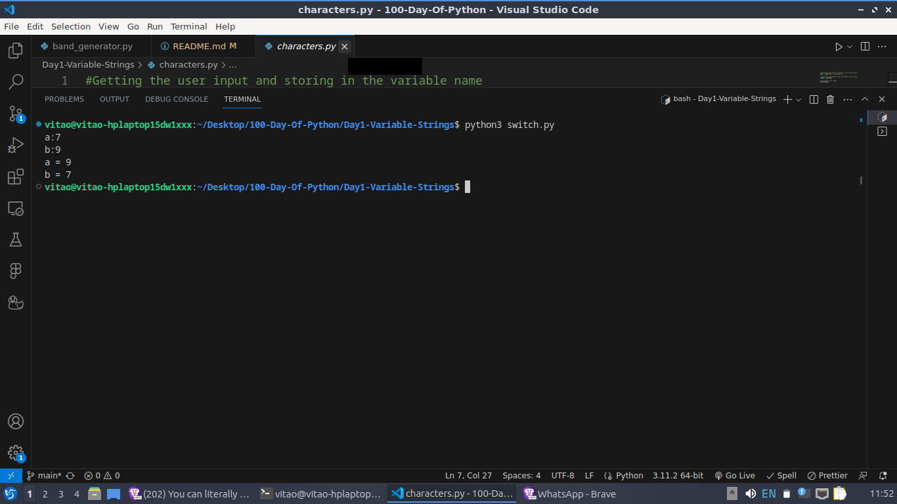
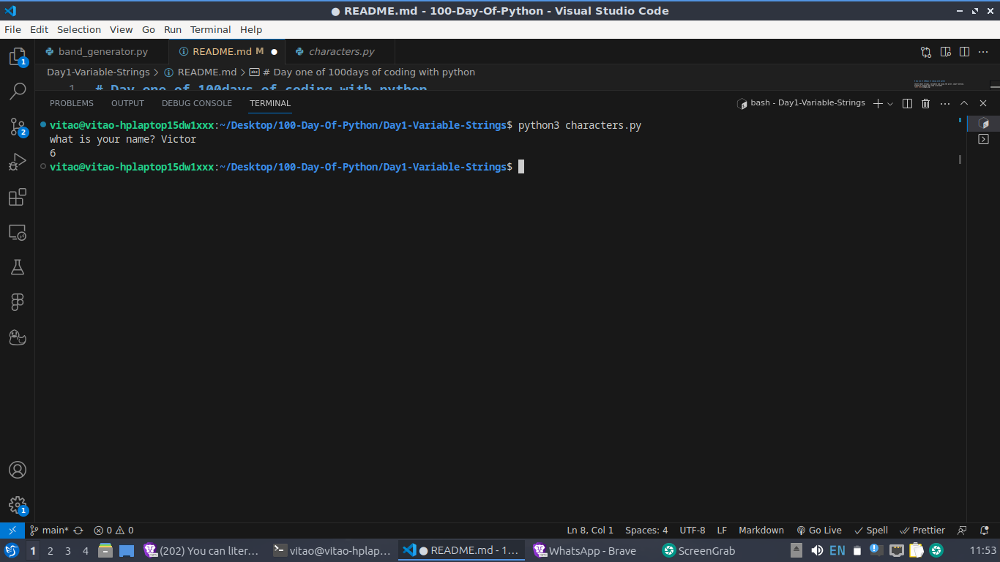
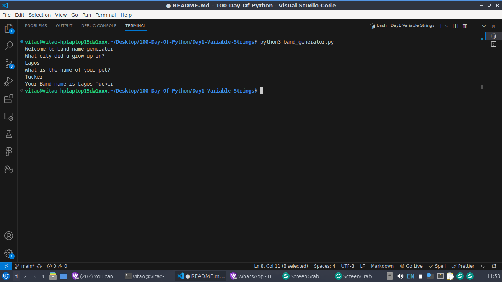

# Day one of 100days of coding with python

learnt about strings, variables and using the print, input function.

## Created a program that swap a variable

## created a program gets length of a string

## created a band generator program

