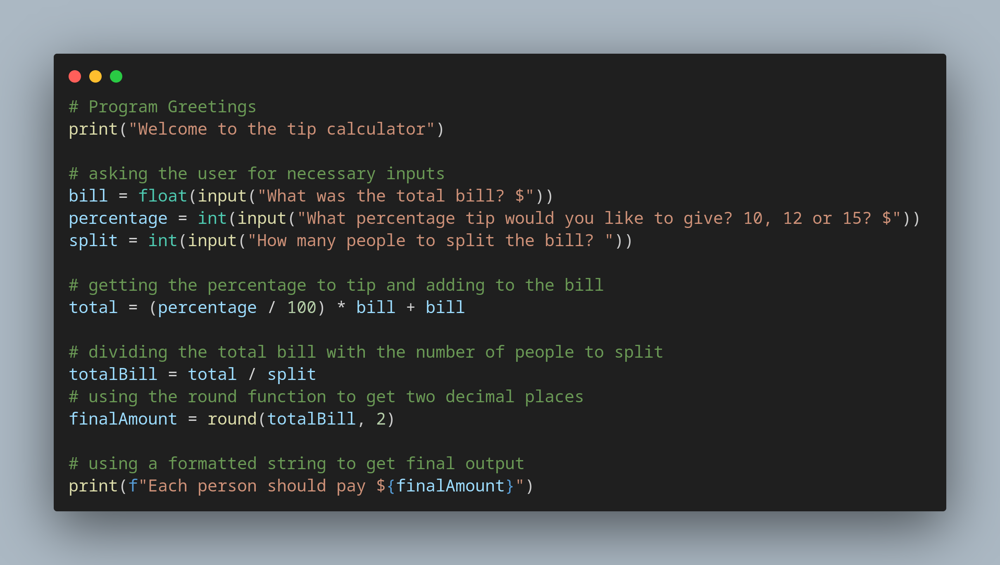

# Day 2 of 100 days of coding with python

## Learnt about python data types, Manipulating string and performing mathematical operations in python

## Created a Tip calculator from the concepts i learned today

