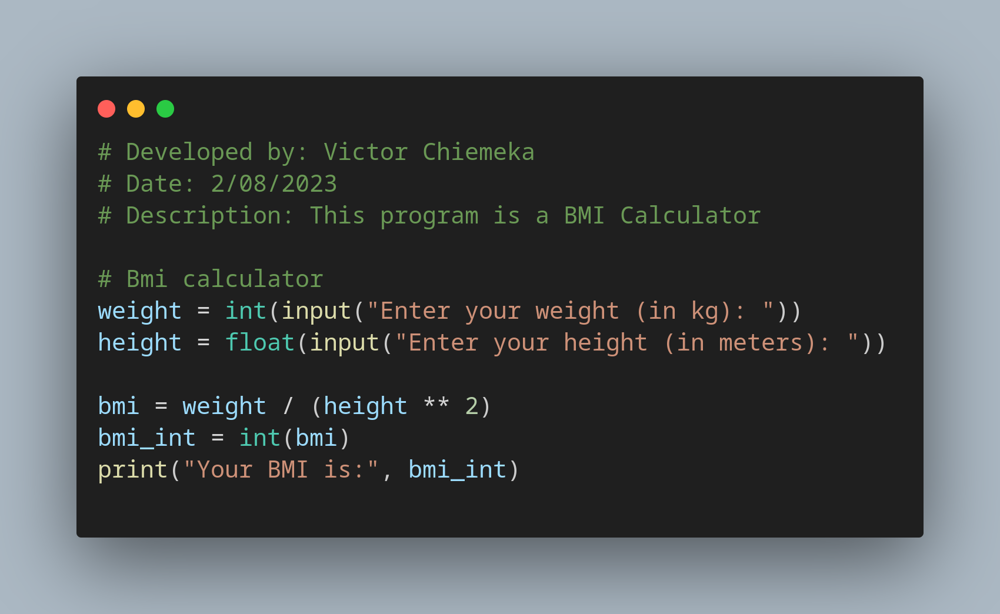

# Day 2 of 100 Days of Coding with Python

Learned about Python data types, manipulating string and performing mathematical operations in Python

## Created a Tip Calculator from the concepts I learned

## Created a Bmi Calculator from the concepts I learned

