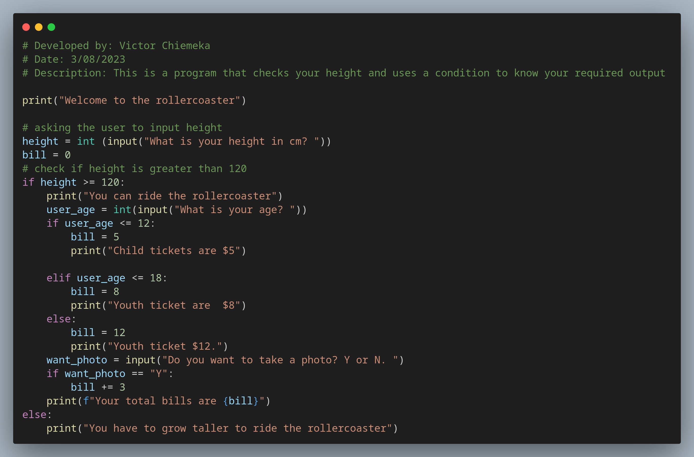
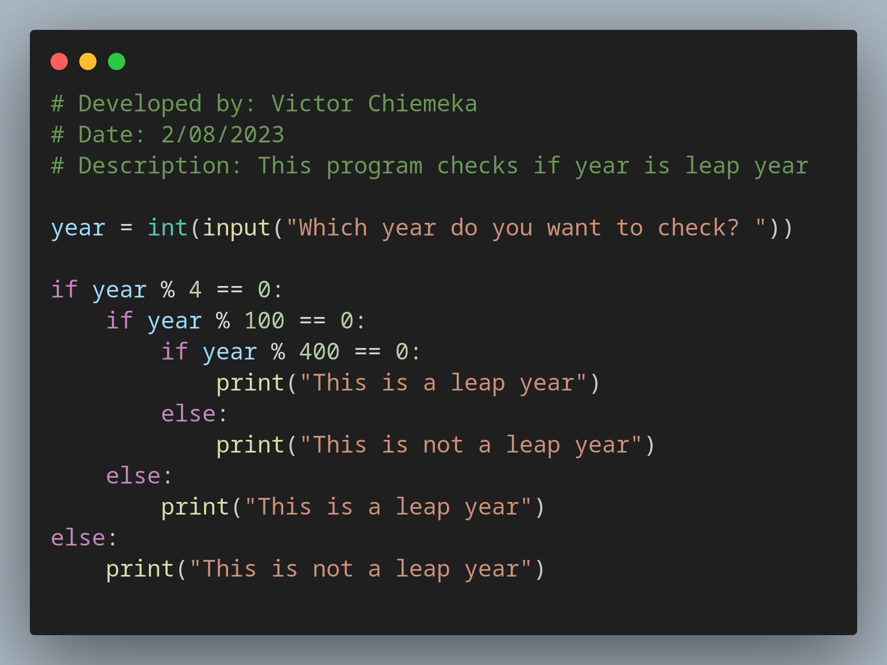
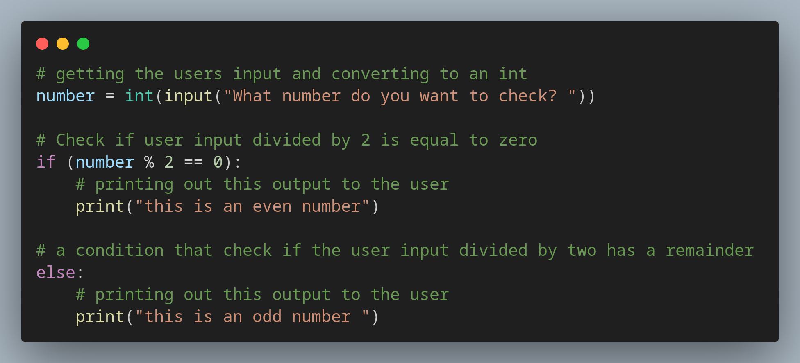
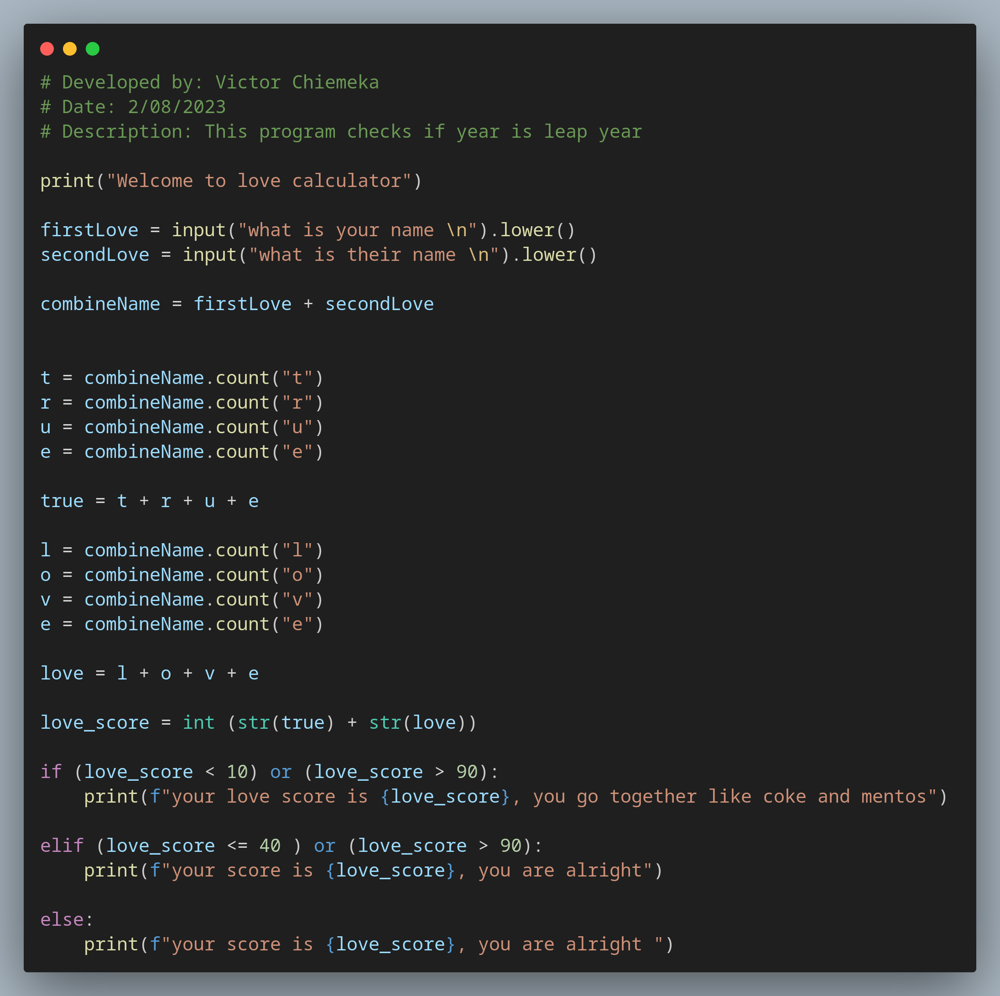
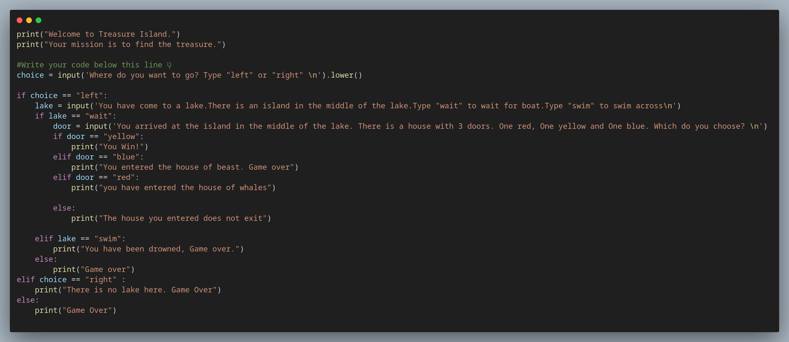

# Day 3 of 100 Days of Coding with Python

Learned about Conditional, Logical Operator, Comparison Operators,
Nested conditions and python indentations

# Created a Rollercoaster Game from the concept I learned

# Created a program that checks if a year is a leap year or not

# Created a program that checks if a number is an Odd number or even

# Created a Love Calculator Program

# Created a Tressure Game from the concepts i learnt today

