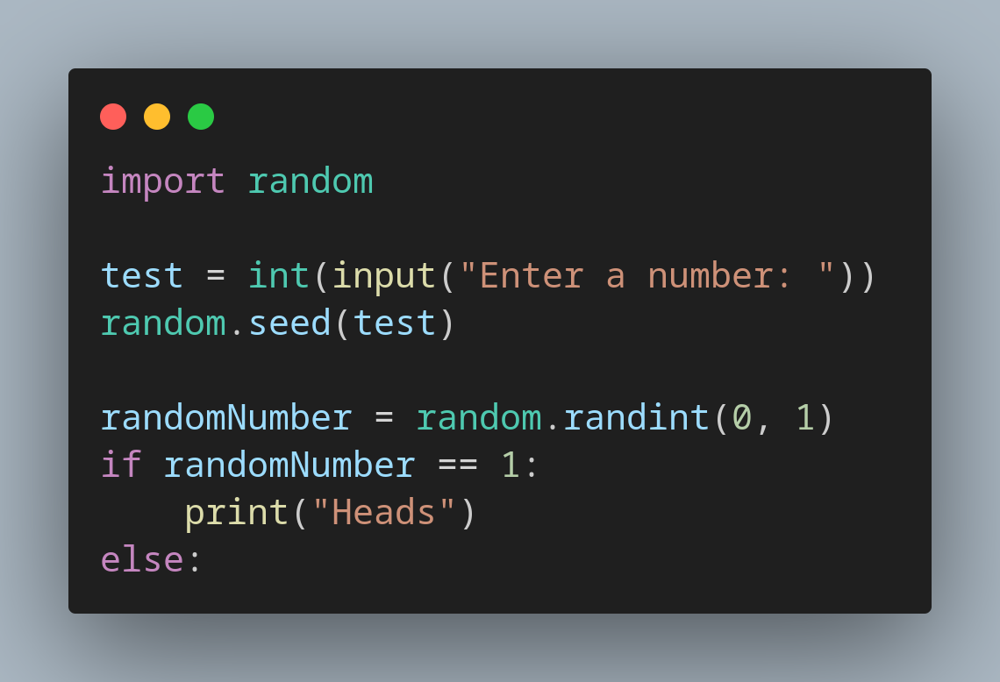

# Day 4 of 100 Days of Coding with Python

Learned about Randomization and Python lists.
Explored the usage of the import keyword and various list methods in Python, along with some basic Python functions.

# Created a Random Meal Treat Picker 

# Created a Coin Toss Simulator 

# Created a Treasure Map Game

