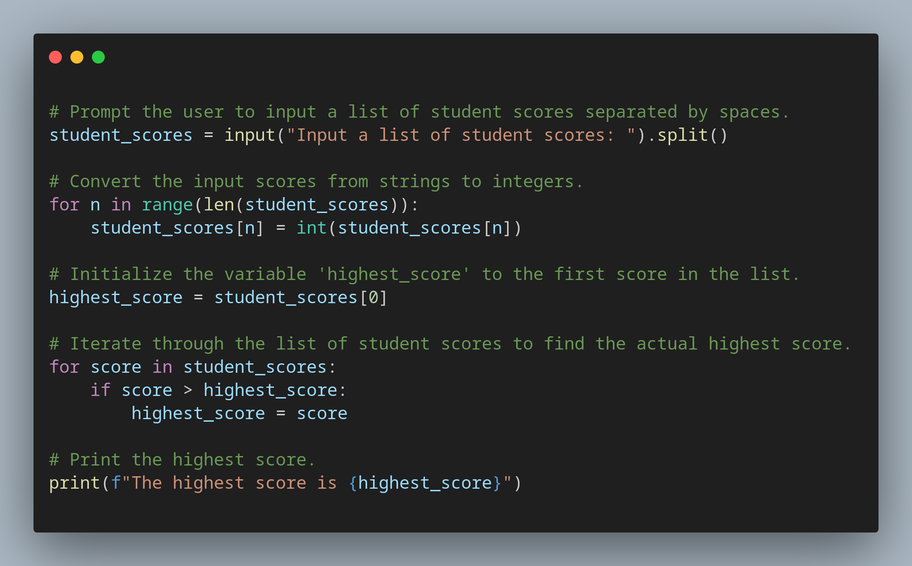
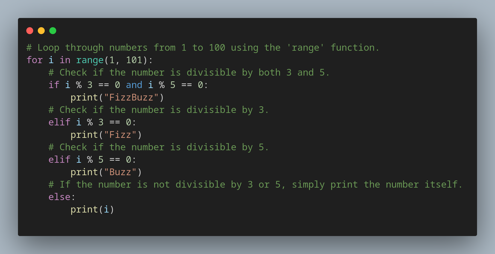

# Day 5 of 100 Days of Coding with Python

Today, I focused on learning about Python loops and using ranges in Python.

I worked on multiple programs to demonstrate my clear understanding of how loops work. This practical experience helped me solidify my knowledge and skills.

# I took on the FizzBuzz challenge.

